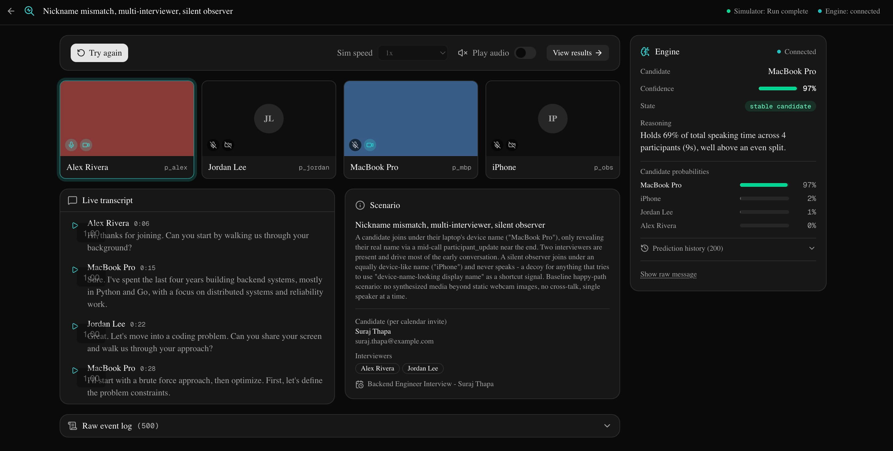
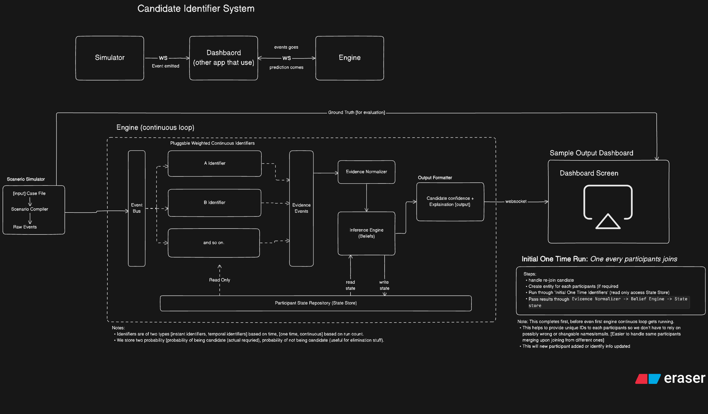
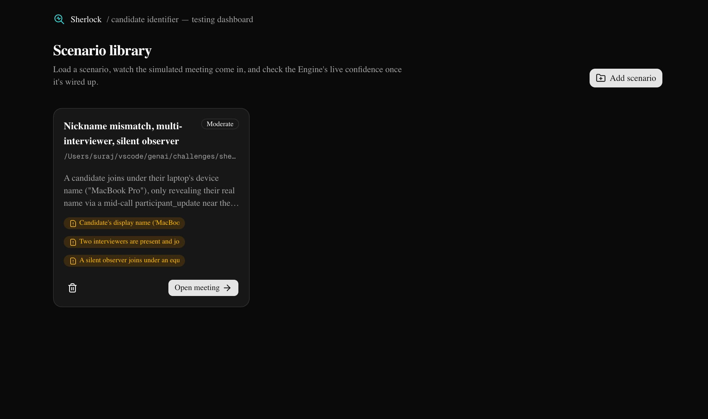
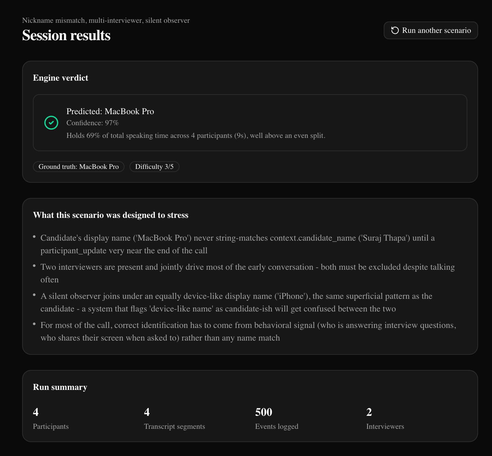

# Sherlock — Candidate Identifier System

A real-time AI system that identifies the interview candidate in a multi-participant video call, even when they join under a pseudonym, device name, or mismatched display name.

---

## Overview

Modern hiring platforms face a verification problem: the person who accepted the calendar invite is not necessarily the person on screen. **Sherlock** solves this by treating candidate identification as a continuous probabilistic inference problem — not a one-shot name match.

The system watches a simulated call as events stream in (participant joins, transcript lines, screen-share toggles, media state changes), runs multiple independent *identifiers* in parallel, and maintains a running Bayesian belief over who in the call is most likely the real candidate. A dashboard surfaces the engine's live verdict, confidence, and reasoning trail in real time.



---

## Architecture

The system is split into three independent applications that communicate over WebSocket:

```
Scenario Simulator ──ws──▶ Dashboard (web) ──ws──▶ Belief Engine
   (raw events)               (relay + UI)         (predictions)
```



### Simulator (`apps/simulator`)

Compiles YAML scenario files into a stream of raw events (`participant_joined`, `transcript`, `screen_share_started`, …) and emits them over WebSocket at configurable playback speed. The simulator is entirely separate from the engine — it has no inference logic, only event emission.

### Dashboard (`apps/web`)

A Next.js application that:
- Receives the raw event stream from the simulator
- Relays events to the Belief Engine
- Displays participants, live transcript, scenario context, and the engine's real-time predictions in a side panel



### Belief Engine (`apps/engine`)

A Python FastAPI + WebSocket service that performs the actual identification. It maintains a `ParticipantStateRepository` shared across all components, then runs a pipeline of *identifiers* on every incoming event.

---

## How the Engine Works

### Identifiers

Each identifier is a self-contained signal extractor that fires on relevant events and emits a `NormalizedEvidence` object containing:
- `candidate_logit` — how much this observation supports "this person is the candidate"
- `not_candidate_logit` — how much it supports "this person is definitely not the candidate"
- `reasoning` — a human-readable explanation line shown in the UI

| Identifier | Signal | Type |
|---|---|---|
| `name_match` | Participant display name vs. calendar invite name | Instant, one-time |
| `email_identity` | Email match from participant metadata | Instant, one-time |
| `host_organizer` | Meeting host / organizer role heuristic | Instant, one-time |
| `speaking_share` | Proportion of speaking time relative to equal split | Temporal, continuous |
| `qa_pattern` | Asymmetric Q&A behaviour (one person asks, another answers) | Temporal, continuous |
| `screenshare_heuristic` | Who shares their screen when prompted | Instant, continuous |
| `silent_observer` | Long silence in a multi-participant call → less likely candidate | Temporal, continuous |
| `llm_name_role` | LLM analysis of transcript turns for name/role signals | Temporal, continuous |
| `llm_transcript_role` | LLM analysis of conversational role (interviewer vs. interviewee) | Temporal, continuous |

### Belief Accumulation

Evidence from each identifier is accumulated as **log-odds** with per-identifier **exponential decay** (so old signal fades if no new evidence arrives). Two independent tracks are maintained:

- **`logit_candidate`** — log-odds of *being* the candidate. Converted to a probability via **softmax** across all participants (a zero-sum competition — as one person becomes more likely, others become less likely).
- **`logit_not_candidate`** — log-odds of *not* being the candidate (e.g. strong interviewer signal). Converted via **sigmoid**, independently per participant — multiple people can simultaneously be "clearly not the candidate".

### Detection States

The engine progresses through a one-way state machine:

| State | Meaning |
|---|---|
| `exploring` | **Warmup gate.** The engine refuses to name anyone until ≥ 20 s of session time *and* ≥ 3 evidence pieces have accumulated. Prevents premature mis-identification based on who happened to join first. |
| `searching` | Warmup cleared. No participant has cleared the evidence floor yet. |
| `likely_candidate` | Someone has cleared the evidence floor but isn't yet a clean, unambiguous leader. |
| `stable_candidate` | The leader clears the confidence threshold with a sufficient margin over the second-place participant, held for multiple consecutive snapshots. |
| `lost_candidate` | Was stable; the leader dropped below the exit threshold. Transitional — re-derives fresh on the next snapshot. |

The `possible_candidate_ids` field in every engine message is `[]` during `exploring` and `searching`, so the downstream system never receives a premature or random guess.

### Results

After a run completes, the session results page shows the engine's final verdict against the ground truth:



---

## Getting Started

### Prerequisites

- Node.js ≥ 18, pnpm
- Python ≥ 3.12, uv

### Install

```sh
pnpm install
```

### Run (all apps in parallel)

```sh
pnpm dev
```

This starts:
- `apps/web` — dashboard at `http://localhost:3000`
- `apps/engine` — belief engine WebSocket at `ws://localhost:8000`
- `apps/simulator` — scenario simulator WebSocket at `ws://localhost:8001`

### Engine only

```sh
cd apps/engine
uv run python -m engine
```

### Simulator only

```sh
cd apps/simulator
uv run python main.py
```

---

## Project Structure

```
.
├── apps/
│   ├── engine/          # Python belief engine (FastAPI + WebSocket)
│   │   └── src/engine/
│   │       ├── core/    # BeliefEngine, DetectionState, OutputFormatter, StateStore
│   │       └── identifiers/  # Pluggable identifier implementations
│   ├── simulator/       # Python scenario simulator
│   │   └── scenarios/   # YAML scenario files
│   └── web/             # Next.js dashboard
│       └── src/
│           ├── components/session/   # Session UI (EnginePanel, LiveTranscript, …)
│           ├── lib/engine-client.ts  # WebSocket client with auto-reconnect
│           └── store/session-store.ts
├── arch/                # Architecture diagrams
├── docs/                # Additional documentation
│   └── simulator.md
└── screenshots/         # UI screenshots
```

---

## Tuning

Key constants are co-located with their logic and documented at the point of definition:

| Constant | File | Default | Purpose |
|---|---|---|---|
| `MIN_ELAPSED_SECONDS` | `detection_state.py` | `20.0 s` | Minimum session time before any candidate is named |
| `MIN_EVIDENCE_PIECES` | `detection_state.py` | `3` | Minimum total evidence entries across all participants |
| `INSUFFICIENT_EVIDENCE_THRESHOLD` | `output_formatter.py` | `0.35` | Minimum probability to be included in `possible_candidate_ids` |
| `CONFIDENT_THRESHOLD` | `output_formatter.py` | `0.55` | Minimum probability for a single-candidate confident pick |
| `AMBIGUITY_MARGIN` | `output_formatter.py` | `0.15` | Minimum gap between leader and runner-up for a clean pick |
| `STABLE_ENTRY_STREAK` | `detection_state.py` | `2` | Consecutive qualifying snapshots to enter `stable_candidate` |
| `STABLE_EXIT_THRESHOLD` | `detection_state.py` | `0.45` | Exit bar (lower than entry — hysteresis to prevent flapping) |
| `NO_EVIDENCE_BASELINE_LOGIT` | `belief_engine.py` | `-1.5` | Softmax input for participants with zero evidence (prevents 100% from being the only element in the pool) |

---

## Further Reading

- [Simulator docs](docs/simulator.md)
- [Scenario authoring guide](apps/simulator/docs/SCENARIO_AUTHORING.md)
